# Online Cab Management System 
 

### Aim
Cabby Shacks is a Cab Rental App which allows users to search for available cabs, and subsequently book cabs also. Admin and User are two main working actors of this project. Admin can add cabs, view list of cabs, and update the info about the cabs. The user can search for the cabs according to their city and then book a particular cab using its Cab Id which will be displayed along with the information of the cabs. The user can also view their previous bookings inside the view profile. 

### MySql Database:-
Tables:
1) Cablist 
2) Customers
3) Admins
4) Bookings

### Techstack
###### Java
###### JDBC
###### Java Swing
###### MySql for database

### Screenshots (USER)

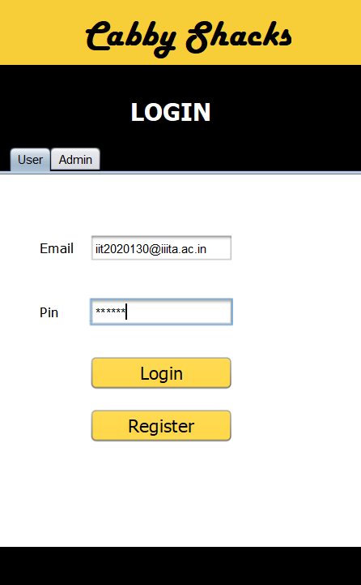
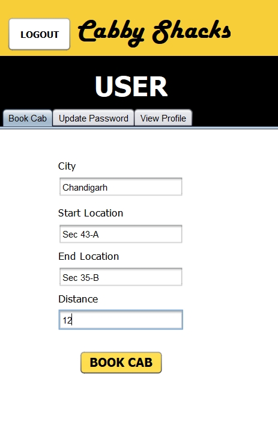
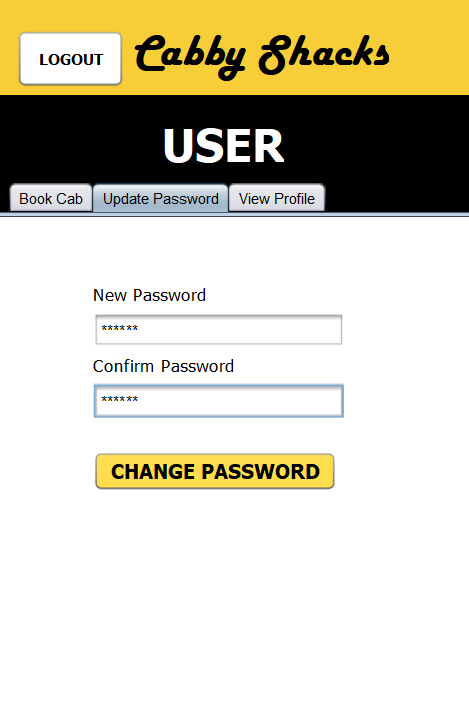
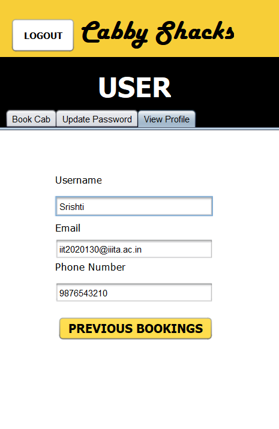
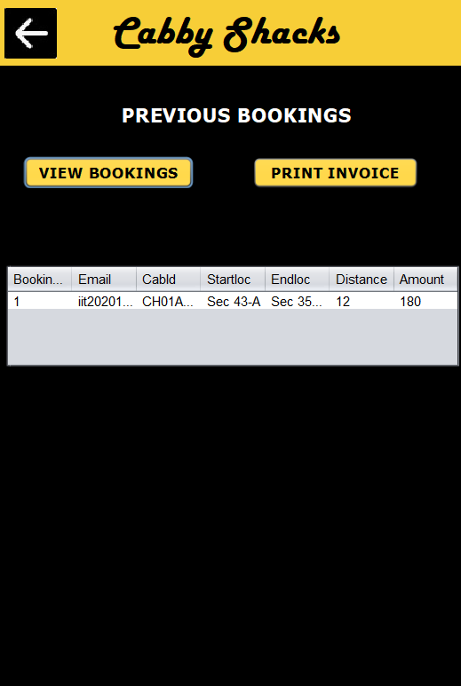
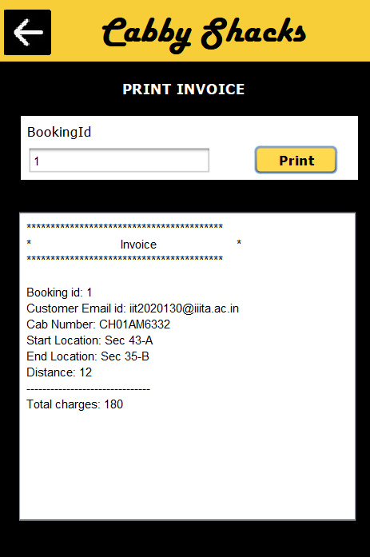
 

 

 

 

### Screenshots (ADMIN)

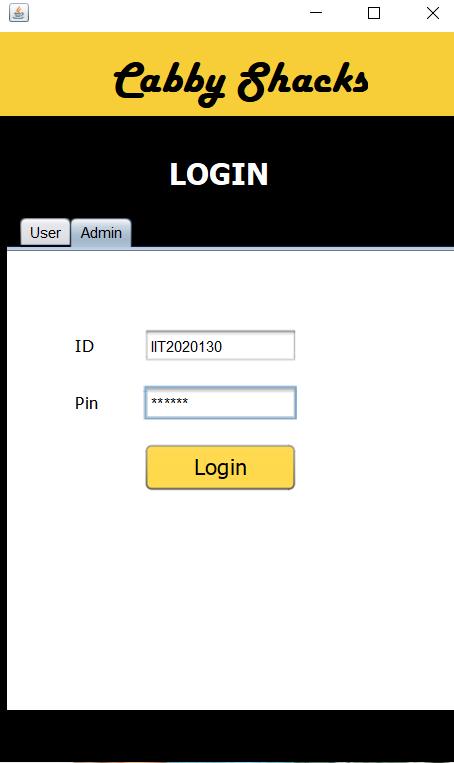
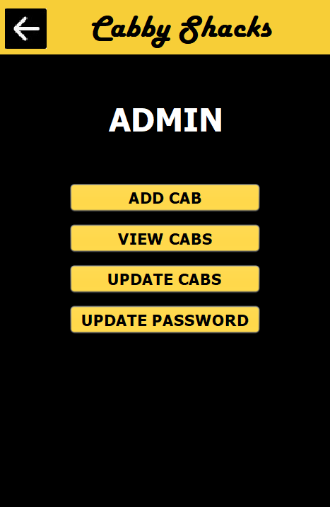
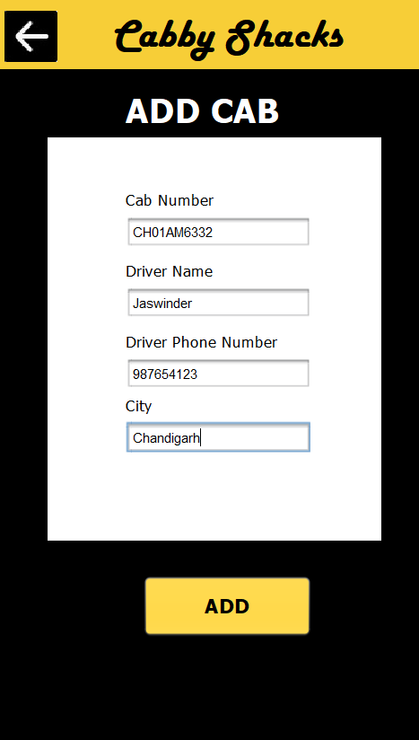
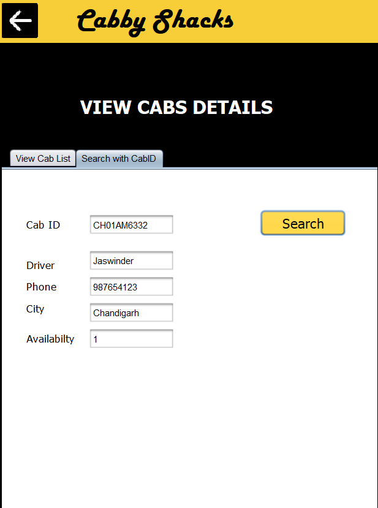
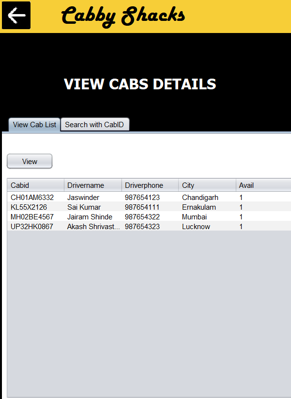
 

