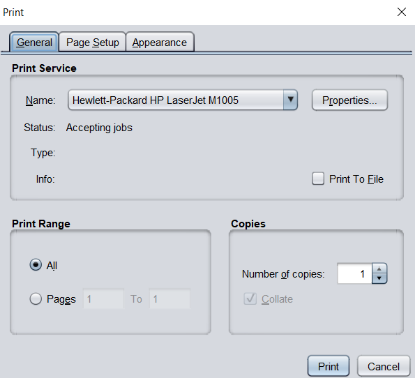

# Online Cab Management System 
 

### Aim
It helps the users to book the cab easily and store the data using mysql database as well as link java code and database using JDBC (Java Database Connectivity).
 
### MySql Database:-
Tables:
1) Cablist 
2) Customers
3) Admins
4) Bookings

### Techstack
###### Java
###### JDBC
###### Java Swing
###### MySql for database

### Screenshots (USER)

 

 

 

 

### Screenshots (ADMIN)

 

